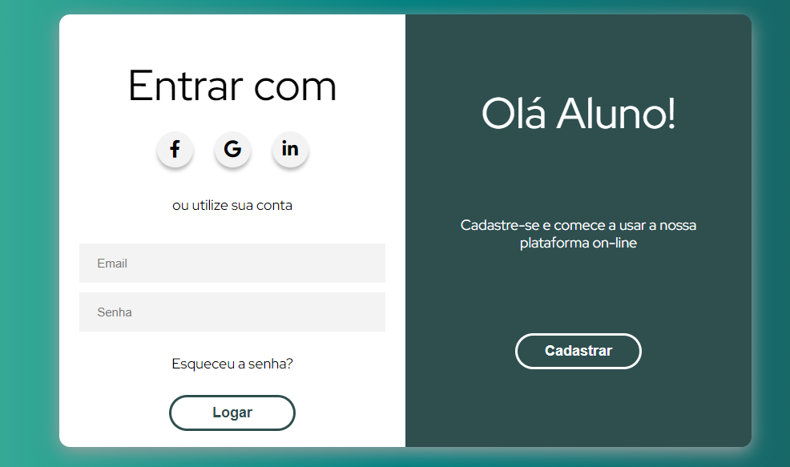

# Login Responsive
Esse é um exemplo de uma página HTML e CSS que é não apenas visualmente atraente, mas também responsiva e adaptável a diferentes dispositivos, garantindo uma experiência de usuário consistente e agradável.




### 🚀 Veja o projeto
[Link do projeto](https://devgabrielrr.github.io/Calculadora-JavaScript/)

### Tecnologias Utilizadas
- HTML5: para a estrutura do site.
- CSS3: para a estilização e layout.
- JavaScript: para a interatividade e manipulação dos dados.
- GitHub Pages

### Funcionalidades

- [x] Design Responsivo:  O layout foi cuidadosamente desenvolvido para ser completamente responsivo. Independentemente do dispositivo utilizado, seja um desktop, tablet ou smartphone, os visitantes desfrutarão de uma experiência consistente e agradável.

 ## 🛠️ Como Executar o Projeto
1. Faça um clone desse repositório e acesse o diretório.

    ```bash
    $ git clone https://github.com/DevGabrielrr/Login_responsive.git
    ```
2. Navegue até o diretório do projeto:

    ```bash
    cd nome-do-repositorio
    ```

3. Abra o terminal de sua IDE e use o comando logo abaixo para abrir no navegador Web, ira instalar um servidor globalmente
 :

    ```bash
    npm install -g http-server
    ```
    
    ```bash
    http-server

    ```

